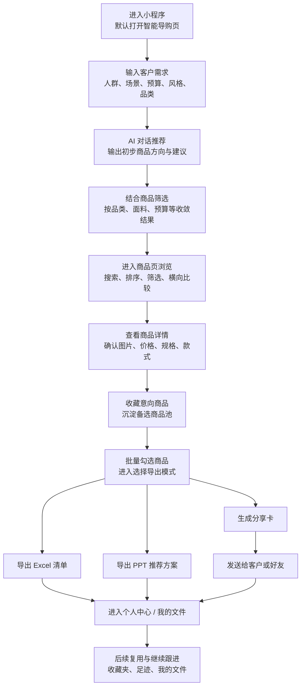

# 万事利丝绸 AI 导购助手项目整理

本文基于当前项目中的培训演示脚本、页面截图和导出素材整理，适用于培训讲解、项目汇报、宣传介绍、方案说明等场景。

## 一、项目背景

“万事利丝绸 AI 导购助手”是面向万事利丝绸选品、导购、推荐与方案输出场景打造的小程序工具。它并不是单纯的商品展示页，而是一套围绕“客户需求理解 - 商品筛选推荐 - 方案导出分享 - 结果沉淀复用”设计的智能导购工作台。

在丝绸产品销售与客户接待过程中，导购人员经常会遇到以下问题：

- 客户需求表达模糊，例如只说“想买礼物”或“想看高端一点的”，难以快速锁定合适商品；
- 商品品类多、规格多、材质多，人工逐个查找和比对效率较低；
- 推荐结果需要进一步整理成可发给客户的正式方案，传统整理方式耗时较长；
- 已推荐、已导出的商品和方案缺少统一沉淀，后续复用不方便。

基于这些实际业务场景，万事利丝绸 AI 导购助手通过 AI 对话、商品检索筛选、方案导出和个人中心归档等能力，把导购流程从“找商品”升级为“做方案”，帮助门店、销售、运营和接待人员更高效地完成选品推荐和客户沟通。

从项目定位来看，这个小程序既可以作为内部培训与业务演示工具，也可以作为实际接待客户时的智能选品助手，突出万事利丝绸在产品丰富度、场景化推荐和数字化服务上的能力。

## 二、产品功能

当前小程序的核心功能可以概括为三大模块：智能导购、商品浏览、个人中心。

### 1. 智能导购

智能导购是小程序最核心、最高频使用的入口，主要承接“对话理解需求 - AI 推荐商品 - 辅助筛选 - 导出分享”这一主流程。

核心能力包括：

- AI 对话推荐  
  用户可以直接输入客户需求，例如送礼对象、使用场景、预算区间、风格偏好、产品类型等，AI 会基于描述快速给出适合的丝绸选品方向与商品建议。

- 推荐语引导  
  页面预置了推荐问法和快捷问题示例，帮助使用者快速进入对话场景，也便于培训时统一讲解。

- 条件补充与需求收敛  
  在 AI 对话基础上，用户还可以继续补充关键词、场景、风格、预算等信息，让推荐范围更加精准。项目中的培训脚本明确强调：需求说得越完整，AI 推荐越精准。

- 筛选联动  
  智能导购页底部保留商品筛选和输入框，支持在推荐过程中边聊边调，快速缩小范围。

- 导出与分享  
  在智能导购页可进入“选择导出”模式，对商品进行多选，并进一步导出 Excel、PPT 或生成分享卡，用于后续对客发送和方案沉淀。

### 2. 商品浏览

商品模块是标准化商品库浏览入口，适合在目标较明确时直接检索和筛选。

核心能力包括：

- 商品搜索  
  支持通过商品名、分类、材质等关键词快速定位目标商品。

- 分类浏览  
  支持围巾专区、丝巾专区、睡衣专区、礼盒专区、家居家纺等品类浏览，便于按品类快速切入。

- 排序与筛选  
  支持按综合、销量、价格等维度排序，并进一步按品类、面料、预算等条件筛选，提高查找效率。

- 商品卡片浏览  
  商品列表中展示主图、名称、规格、价格、评分等核心信息，便于快速横向比较。

- 收藏与加入备选  
  用户可将心仪商品加入收藏，后续用于批量导出 PPT 或继续做推荐方案。

### 3. 商品详情

当用户点击具体商品后，会进入商品详情页，完成从浏览到确认的转化动作。

详情页当前体现出的能力包括：

- 商品大图展示，便于看图选款；
- 展示价格、商品名称、规格等关键信息；
- 支持收藏当前商品，且收藏内容可在后续生成 PPT 时直接复用；
- 支持分享，便于单品快速转发；
- 支持查看不同规格或款式信息，帮助进一步确定推荐结果。

这个页面承担的是“看图、选款、行动”的关键节点，是从推荐走向成交或方案固化的重要一环。

### 4. 导出能力

导出能力是该项目区别于普通商品展示小程序的关键亮点之一，也是培训演示中的重点内容。

目前可见的导出能力包括：

- 导出 Excel  
  在智能导购页面进入“选择导出”后，可勾选多个商品，快速生成 Excel 商品清单，适合内部整理、客户留档或后续二次加工。

- 导出 PPT  
  勾选商品后可直接生成产品推荐方案 PPT，用于正式提案、客户汇报和面对面讲解。

- 生成分享卡  
  用户可将选中的商品生成分享卡，以更轻量的方式发给客户，适合微信内快速传播和沟通确认。

- PPT 结果预览  
  导出的推荐方案支持预览页面展示，强化方案成品感。

- 文件归档  
  导出的 PPT、Excel 等文件会沉淀到“我的文件”中，后续可继续查看、保存到本地或发送给好友。

### 5. 个人中心

个人中心承担的是“结果沉淀、复用管理、账号信息管理”的功能。

当前可见能力包括：

- 收藏夹管理  
  收藏商品会集中沉淀，且支持导出已选 PPT，适合将心仪商品整理为推荐方案。

- 我的足迹  
  用于回看最近浏览过的商品，方便根据客户兴趣继续跟进。

- 我的文件  
  所有导出的 Excel、PPT 等结果文件统一归档，可后续继续查看、管理、保存和转发。

- 账号与权限  
  支持查看账号状态、权限与管理入口，适合内部业务使用场景。

整体上，个人中心不是单纯的信息页，而是选品结果的归档处，也是二次复用与持续跟进的起点。

## 三、产品使用的完整内容

如果从一次完整的导购使用过程来看，万事利丝绸 AI 导购助手的典型使用路径如下：

### 第一步：进入智能导购页

用户打开小程序后，默认进入“智能导购”页面。页面中提供推荐问法、输入框和商品筛选入口，适合作为整套导购流程的起点。

这一页适合承接客户最初的模糊需求，例如：

- 适合作为生日礼物的真丝单品；
- 适合商务送礼的高端礼盒；
- 更适合春夏搭配的轻盈款式；
- 某个预算区间内的丝巾、家纺或礼盒产品。

### 第二步：输入客户需求，与 AI 对话

用户可以像聊天一样输入需求。为了让 AI 推荐更准确，建议尽量把信息说完整，包括：

- 送礼对象或使用人群；
- 使用场景；
- 风格偏好；
- 预算范围；
- 希望的产品类型。

例如：

- “请推荐适合送给女性客户的高端丝绸礼盒，预算 500 到 1000 元。”
- “我想找适合商务拜访的真丝礼品，整体风格要稳重、有品质感。”
- “给春夏穿搭搭配用，想看轻薄一点、颜色年轻一点的丝巾。”

这一步的关键不是“随便问”，而是“把需求说清楚”。越具体，AI 越容易给出贴合业务场景的推荐结果。

### 第三步：结合筛选条件进一步收敛结果

在 AI 给出推荐后，用户可以结合商品筛选功能进一步收窄范围。当前页面支持按照以下维度进行筛选：

- 品类；
- 面料；
- 预算；
- 以及其他商品属性。

使用上通常是先通过关键词和需求描述定方向，再通过筛选条件做收敛。这样既保留了 AI 推荐的灵活性，也保留了商品检索的精准性。

### 第四步：查看商品列表，进行比较和挑选

如果需要更系统地看商品，用户可以点击底部中间的“商品”Tab 进入商品库。

在商品页中，可以完成以下动作：

- 搜索具体商品名、分类或材质；
- 按综合、销量、价格等排序；
- 查看多个商品卡片，快速横向比较；
- 收藏意向商品；
- 为后续导出方案做备选沉淀。

这一步更适合需求已逐渐明确，需要做候选池整理的场景。

### 第五步：进入商品详情页确认单品

当某个商品符合需求时，用户可以进入商品详情页查看：

- 商品主图；
- 价格；
- 规格；
- 当前款式信息；
- 收藏状态；
- 分享入口。

如果该商品适合进入方案，可直接收藏。项目当前页面还明确提示，收藏的商品后续生成 PPT 时可以直接复用，这意味着收藏动作并不是简单留档，而是后续方案输出的准备步骤。

### 第六步：批量选择商品并导出方案

当用户已经整理出一批适合推荐的商品后，可以回到智能导购页，点击“选择导出”进入多选导出模式。

在该模式下，用户可以：

- 勾选推荐商品；
- 导出 Excel 商品清单；
- 导出 PPT 推荐方案；
- 或切换到分享模式生成分享卡。

这一步把零散商品浏览转化成正式方案，是整个产品价值非常核心的一环。

### 第七步：生成分享卡并发送客户

如果希望以更轻量、更适合即时沟通的方式发送推荐结果，可以选择“分享”并生成分享卡。

分享卡通常适用于：

- 微信内快速发送给客户；
- 先发一个轻量方案做初步沟通；
- 让客户先看候选商品，再决定是否继续深入沟通。

相比 Excel 和 PPT，分享卡更轻便；相比直接发单个商品，又更适合成组表达推荐意图。

### 第八步：在个人中心沉淀、复用和继续处理

完成推荐后，用户可进入“个人中心”进行后续管理。

主要有三类内容可以继续使用：

- 收藏夹：沉淀意向商品，可继续导出 PPT；
- 我的足迹：回看浏览历史，跟进客户兴趣；
- 我的文件：查看已导出的 Excel、PPT 等内容，并可继续保存到本地或发送给好友。

从培训和业务流程角度看，这一步非常重要，因为它保证了推荐结果不是一次性动作，而是可回看、可复用、可继续传播的业务资产。

## 四、产品使用流程图

下面这张流程图可以用于说明万事利丝绸 AI 导购助手的完整使用闭环：

如果需要在汇报时做更口语化的解释，可以概括为：

先通过智能导购理解客户需求，再结合商品筛选和商品浏览缩小范围，随后进入详情页确认商品，将合适商品收藏或加入备选，最后统一导出为 Excel、PPT 或分享卡，并在个人中心完成沉淀和复用。

## 五、项目亮点总结

如果需要一句话概括该项目，可以表述为：

万事利丝绸 AI 导购助手，是一款把 AI 对话推荐、商品筛选浏览、方案导出分享与结果沉淀复用打通在一个小程序里的智能选品工具。

进一步总结，项目亮点主要体现在：

- 以 AI 对话降低选品门槛，让需求表达更自然；
- 以筛选和商品库能力提高查找效率，让推荐更精准；
- 以 Excel、PPT、分享卡导出能力提升方案交付效率；
- 以收藏、足迹、文件归档机制沉淀结果，便于后续复用；
- 适合培训演示、销售接待、客户推荐、内部汇报等多个场景。

## 六、适合对外或对内介绍的标准版表述

可直接用于汇报或讲解的版本如下：

万事利丝绸 AI 导购助手，是围绕丝绸产品推荐场景打造的一款智能导购小程序。它以智能导购页为核心入口，通过 AI 对话理解客户需求，再结合商品检索、分类筛选、详情查看、收藏沉淀等功能，帮助用户快速完成选品推荐。与此同时，小程序支持将推荐结果一键导出为 Excel 商品清单、PPT 推荐方案或分享卡，方便销售人员进一步对客沟通和方案展示。所有收藏商品、浏览足迹和导出文件还可在个人中心统一管理，实现从需求理解、商品推荐到方案输出和结果沉淀的完整闭环。
